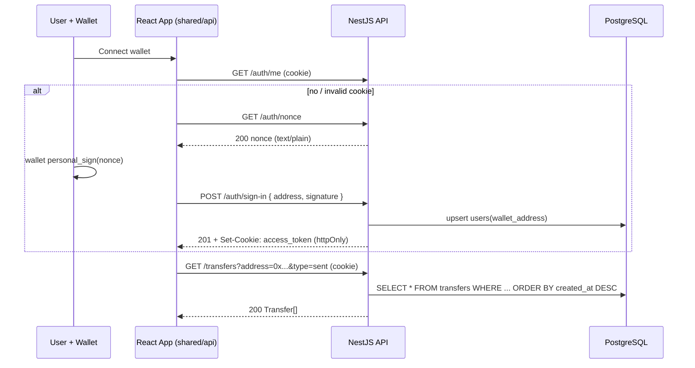

# API Reference

This document is the authoritative HTTP API contract for the **Token Dashboard** backend.

- **Base URL:** `http://localhost:3000` in development. The port comes from `PORT` (`process.env.PORT ?? 3000`, see [`api/src/main.ts`](../api/src/main.ts)). In the browser, the frontend talks to the API through a same-origin path: in dev, Vite proxies `/auth` and `/transfers` to `http://localhost:3000`, and the API client uses a relative base URL.
- **Transport:** JSON over HTTP. Request and response bodies are `application/json`, except `GET /auth/nonce`, which returns a `text/plain` string.
- **Framework:** the backend is a [NestJS 11](https://nestjs.com/) application, loosely structured along DDD lines (see [Backend](./backend.md)).
- **No gateway:** there is **no** Next.js / BFF gateway. The frontend is **React + Vite**, which has no server-side API routes, so the React app calls this NestJS backend **directly** over HTTP/JSON. Same-origin requests flow through the Vite dev proxy; CORS on NestJS (`enableCors({ origin: FRONTEND_URL, credentials: true })`) is configured as a fallback for cross-origin/production use. On the frontend, the FSD `shared/api` layer is the single network boundary — see [Frontend](./frontend.md).
- **Auth model:** authentication is **cookie-based**, not bearer-token. After a successful sign-in the backend sets an `httpOnly` cookie named `access_token` (a JWT). Protected routes read this cookie; the browser sends it automatically because the API client always uses `credentials: 'include'`. There is no `Authorization: Bearer` header in this contract.

The only resource endpoint is **transfer history** (`GET /transfers`). The signature-auth endpoints (`/auth/*`) gate it. Wallet connection, balance reads, and the ERC-20 `transfer` transaction all happen client-side via the injected wallet + viem; the backend only serves transfer records that already exist in the database.

> **Note:** there is currently **no** `POST /transfers` endpoint and **no** Swagger/OpenAPI UI. Transfer rows are populated by seed data (`api/db/transfers.seed.sql`). An on-chain `Transfer` event listener exists (`NodeListener`) but at present it only logs events to the console — it does **not** yet persist them to the database. See [Known gaps](#known-gaps).



---

## Conventions

| Topic | Convention |
| --- | --- |
| **Content type** | Responses are `application/json`, except `GET /auth/nonce` which is `text/plain`. The `POST /auth/sign-in` request body is `application/json`. |
| **Auth** | Cookie-based. The `access_token` JWT cookie is `httpOnly`, `SameSite=Lax`, `path=/`, `maxAge` 1 day, and `secure` only when `NODE_ENV === 'production'`. The browser must send it with every protected request (`credentials: 'include'`). |
| **Timestamps** | The `created_at` field is serialized from a Postgres `TIMESTAMPTZ(3)` column. In JSON it is an **ISO-8601** string in UTC, e.g. `2026-06-16T10:30:00.000Z`. |
| **Amounts** | The `amount` field is a Postgres `NUMERIC` column, serialized as a **decimal string** (e.g. `"12.5"`). Treat it as a string to avoid floating-point precision loss for 18-decimal tokens. |
| **Addresses** | EVM addresses are `0x` + 40 hex characters, validated by `class-validator`'s `@IsEthereumAddress`. Before querying, the backend **lower-cases** the address, so comparisons are case-insensitive. |
| **IDs** | Row `id`s are **UUID v7** strings (Postgres `uuidv7()` default), not auto-incrementing integers. |
| **Errors** | Failures use the standard NestJS error envelope: `{ statusCode, message, error }`. `message` is a `string` for single errors or a `string[]` for validation errors. See [Schemas](#schemas). |
| **Validation** | A global `ValidationPipe({ whitelist: true, transform: true })` runs on every request. `whitelist: true` strips unknown properties; `transform: true` coerces payloads into the DTO classes. |

---

## GET /transfers

Return the transfer history for a single address. **Protected** — the global `AuthGuard` requires a valid `access_token` cookie. Results are ordered by `created_at` **descending** (newest first). The `transfer-history` widget renders this directly.

By default a transfer is included when the address is **either** the sender **or** the recipient (`address_from = $1 OR address_to = $1`). The optional `type` filter narrows this to one direction.

Defined in [`api/src/modules/transfers/transfers.controller.ts`](../api/src/modules/transfers/transfers.controller.ts) and [`transfers.service.ts`](../api/src/modules/transfers/transfers.service.ts).

### Query parameters

| Param | Required | Rules |
| --- | --- | --- |
| `address` | **Yes** | Valid EVM address (`0x` + 40 hex), validated by `@IsEthereumAddress`. Lower-cased before the query runs. |
| `type` | No | One of `"sent"` or `"received"` (`@IsIn(['sent', 'received'])`). `sent` filters on `address_from`, `received` filters on `address_to`. Omit it to match either side. Any other value is a `400`. |

### Responses

**`200 OK`** — a JSON array of [Transfer](#schemas) objects, newest first. The array is empty (`[]`) when the address has no matching history.

```json
[
  {
    "id": "018f9c2a-7b3d-7e10-9a55-6c2f0b1d4e77",
    "address_from": "0x70997970c51812dc3a010c7d01b50e0d17dc79c8",
    "address_to": "0x3c44cdddb6a900fa2b585dd299e03d12fa4293bc",
    "amount": "12.5",
    "tx_hash": "0xabc1230000000000000000000000000000000000000000000000000000000def",
    "created_at": "2026-06-16T10:30:00.000Z"
  },
  {
    "id": "018f9c2a-1a2b-7e10-9a55-6c2f0b1d4e76",
    "address_from": "0x3c44cdddb6a900fa2b585dd299e03d12fa4293bc",
    "address_to": "0x70997970c51812dc3a010c7d01b50e0d17dc79c8",
    "amount": "3.0",
    "tx_hash": "0xdef4560000000000000000000000000000000000000000000000000000000abc",
    "created_at": "2026-06-16T09:15:00.000Z"
  }
]
```

**`400 Bad Request`** — `address` is missing/invalid, or `type` is not `sent`/`received`.

```json
{
  "statusCode": 400,
  "message": ["address must be an Ethereum address"],
  "error": "Bad Request"
}
```

**`401 Unauthorized`** — no `access_token` cookie, or the JWT is invalid/expired.

```json
{ "statusCode": 401, "message": "Unauthorized" }
```

### curl

```bash
# The cookie is set by POST /auth/sign-in; reuse it here.
curl "http://localhost:3000/transfers?address=0x70997970C51812dc3A010C7d01b50e0d17dc79C8&type=sent" \
  -b cookies.txt
```

---

## Auth Endpoints

Wallet-signature (SIWE-style) authentication. The user proves control of an address by signing a fixed server nonce with their wallet; the backend verifies the signature with viem's `verifyMessage`, upserts the user, and sets a JWT cookie. Implemented in [`api/src/modules/auth/`](../api/src/modules/auth/). Requires `JWT_SECRET` and `WALLET_SIGN_NONCE` on the backend (see the env table in [README](./README.md)).

> The nonce is a single static value read from `WALLET_SIGN_NONCE`, not a per-request random challenge. This is a known simplification.

### GET /auth/nonce

**Public** (`@Public()`). Return the message the wallet must sign.

- **Response:** `200 OK`, `text/plain`. The body is the raw `WALLET_SIGN_NONCE` string (no JSON wrapper).

```
Sign in to Token Dashboard
```

```bash
curl "http://localhost:3000/auth/nonce"
```

### POST /auth/sign-in

**Public** (`@Public()`). Verify the signature over the nonce, upsert the user, and set the auth cookie.

**Request body** (`application/json`):

| Field | Type | Rules |
| --- | --- | --- |
| `address` | `string` | **Required.** Valid EVM address (`@IsEthereumAddress`). |
| `signature` | `string` | **Required.** The wallet's `personal_sign` signature of the nonce returned by `GET /auth/nonce` (`@IsString`). |

```json
{
  "address": "0x70997970C51812dc3A010C7d01b50e0d17dc79C8",
  "signature": "0x1c8aff950685c2ed4bc3174f3472287b56d9517b9c948127319a09a7a36deac8..."
}
```

**Responses:**

- **`201 Created`** — empty body (NestJS' default success status for a `POST` handler with no `@HttpCode` override). The important effect is the `Set-Cookie: access_token=<jwt>; HttpOnly; SameSite=Lax; ...` header. The JWT payload is `{ sub: <userId>, address: <lowercased address> }` and expires in 1 day.
- **`401 Unauthorized`** — the signature does not verify against `address` + nonce.
- **`400 Bad Request`** — body fails DTO validation (missing/invalid `address` or non-string `signature`).

On success the backend upserts into `users (wallet_address)` (a duplicate `23505` unique-violation is ignored), looks up the user `id`, and signs the JWT.

```bash
curl -X POST "http://localhost:3000/auth/sign-in" \
  -H "Content-Type: application/json" \
  -c cookies.txt \
  -d '{
    "address": "0x70997970C51812dc3A010C7d01b50e0d17dc79C8",
    "signature": "0x1c8aff95..."
  }'
```

### GET /auth/me

**Protected** by the global `AuthGuard`. Used by the frontend `AuthProvider` to restore a session on load without re-prompting the wallet.

- **Response:** `200 OK` — `{ "address": "0x..." }` (the lower-cased address taken from the JWT payload).
- **`401 Unauthorized`** — no/invalid `access_token` cookie.

```json
{ "address": "0x70997970c51812dc3a010c7d01b50e0d17dc79c8" }
```

```bash
curl "http://localhost:3000/auth/me" -b cookies.txt
```

### How protection works

A global guard is registered in [`app.module.ts`](../api/src/app.module.ts) via `{ provide: APP_GUARD, useClass: AuthGuard }`, so **every** route is protected by default. Routes opt out with the `@Public()` decorator ([`auth.decorator.ts`](../api/src/modules/auth/auth.decorator.ts) → `SetMetadata('isPublic', true)`). The guard ([`auth.guard.ts`](../api/src/modules/auth/auth.guard.ts)):

1. Returns `true` immediately for `@Public()` handlers.
2. Otherwise reads the `access_token` cookie (parsed by `cookie-parser`).
3. Verifies it with `jwtService.verifyAsync` and sets `request.user = { userId: payload.sub, address: payload.address }`.
4. Throws `401 Unauthorized` if the cookie is missing or verification fails.

---

## Schemas

### Transfer

The object returned inside the `GET /transfers` array. It maps 1:1 to the `transfers` table (raw `pg` query, `SELECT *`) — see [Database](./database.md). Field names are the **snake_case** column names, exactly as returned by Postgres.

| Field | Type | Description |
| --- | --- | --- |
| `id` | `string` | Primary key, UUID v7 (`uuidv7()` default). |
| `address_from` | `string` | Sender EVM address. Column `address_from`. |
| `address_to` | `string` | Recipient EVM address. Column `address_to`. |
| `amount` | `string` | Transfer amount, a `NUMERIC` column serialized as a decimal string. |
| `tx_hash` | `string` | Transaction hash (`0x` + 64 hex). Unique. Column `tx_hash`. |
| `created_at` | `string` | ISO-8601 timestamp (`TIMESTAMPTZ(3)`). Column `created_at`. |

```ts
// api/src/modules/transfers/transfers.service.ts
interface Transfer {
  id: string;
  address_from: string;
  address_to: string;
  amount: string;
  tx_hash: string;
  created_at: Date; // serialized to an ISO-8601 string in JSON
}
```

### Error envelope

Standard NestJS error shape, returned for non-2xx responses.

| Field | Type | Description |
| --- | --- | --- |
| `statusCode` | `number` | HTTP status code (mirrors the response status). |
| `message` | `string \| string[]` | A single message, or an array of messages for validation errors. |
| `error` | `string` | Short reason phrase, e.g. `"Bad Request"`. Omitted on some default exceptions (e.g. bare `401`). |

```ts
interface ErrorEnvelope {
  statusCode: number;
  message: string | string[];
  error?: string;
}
```

---

## Status Codes

| Code | When it occurs |
| --- | --- |
| `200 OK` | Successful `GET /transfers`, `GET /auth/nonce`, or `GET /auth/me`. |
| `201 Created` | Successful `POST /auth/sign-in` (empty body; the effect is the `Set-Cookie` header). NestJS' default `POST` status. |
| `400 Bad Request` | DTO validation failure: missing/invalid `address`, bad `type` on `GET /transfers`, or an invalid `POST /auth/sign-in` body. |
| `401 Unauthorized` | Missing/invalid `access_token` cookie on a protected route, or a signature that fails verification on `POST /auth/sign-in`. |
| `404 Not Found` | Unknown route / unmatched path. |
| `500 Internal Server Error` | Unexpected server-side failure (e.g. database unavailable). Details are logged server-side, not leaked to clients. |

---

## Validation Rules

Enforced by NestJS DTOs via `class-validator`, under the global `ValidationPipe({ whitelist: true, transform: true })`. Unknown properties are stripped (not rejected).

| Field | Where | Required | Rule |
| --- | --- | --- | --- |
| `address` | `GET /transfers` query | Yes | `@IsEthereumAddress` — valid EVM address. |
| `type` | `GET /transfers` query | No | `@IsOptional` + `@IsIn(['sent', 'received'])`. |
| `address` | `POST /auth/sign-in` body | Yes | `@IsEthereumAddress`. |
| `signature` | `POST /auth/sign-in` body | Yes | `@IsString`. |

DTO sources: [`getTransfers.dto.ts`](../api/src/modules/transfers/dto/getTransfers.dto.ts), [`auth.dto.ts`](../api/src/modules/auth/dto/auth.dto.ts).

---

## Known gaps

These are intentional simplifications / TODOs in the current implementation:

- **No write endpoint.** There is no `POST /transfers`. Transfer rows are loaded from `api/db/transfers.seed.sql` (`bun run db:seed`). The intended long-term source is the on-chain event listener below.
- **Listener does not persist.** `NodeListener` ([`api/src/infrastructure/blockchain/node.listener.service.ts`](../api/src/infrastructure/blockchain/node.listener.service.ts)) uses viem `createPublicClient` (Sepolia) + `watchEvent.Transfer`, but its `onLogs` handler only `console.log`s the events. It does **not** insert them into the `transfers` table yet.
- **Static nonce.** `GET /auth/nonce` returns a single fixed `WALLET_SIGN_NONCE`, not a per-request random, expiring challenge.
- **No Swagger UI.** `@nestjs/swagger` is not installed; there is no `/api/docs` route.

---

### Related documentation

- [Backend](./backend.md) — NestJS module layout, guards, DTOs, controllers, and the raw-`pg` data layer.
- [Database](./database.md) — `users` and `transfers` tables, UUID v7 ids, indexes, seed data.
- [Frontend](./frontend.md) — the `shared/api` network boundary and the auth flow that consumes this contract.
- [Postgres setup](./postgres-setup.md) — running the Postgres 18 container with podman and applying schema/seed.
- [README](./README.md) — architecture overview, env table, and how-to-run.
