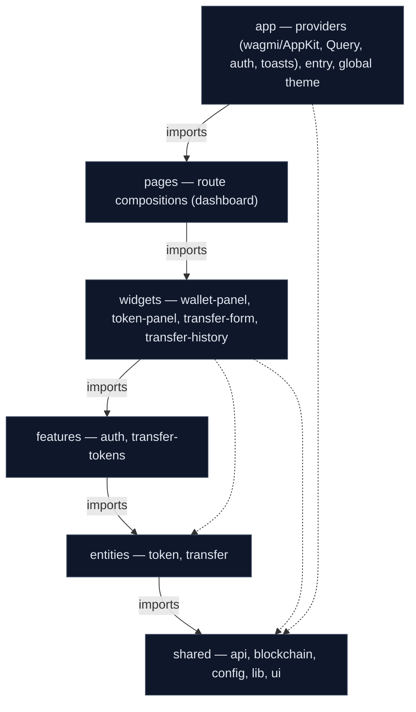

# Frontend Architecture (FSD)

The Token Dashboard frontend is a **React 19 + Vite + TypeScript** single-page application styled with **Tailwind CSS v4** (a CSS-first Material You / Material 3 theme). It lets a user connect a wallet, read the **ERC-20 token** (DevToken / `DVT`) metadata and balances, send a `transfer`, sign in with their wallet (SIWE), and browse the persisted transfer history.

The wallet and chain layer is **wagmi + Reown AppKit** (WalletConnect) rather than a hand-rolled provider context, and on-chain reads/writes go through **viem** under wagmi. **TanStack Query** owns all server and on-chain read caching. There is **no Redux** and **no CSS-modules**.

The codebase follows **Feature-Sliced Design (FSD)** — a methodology that organizes a frontend by *business scope* (layers → slices → segments) rather than by technical file type. We chose FSD for four concrete reasons:

- **Predictable structure** — every piece of code has one obvious home. "Where does the transfer form live?" has a single answer (`widgets/transfer-form`), and "where do we read the token balance?" always resolves to `entities/token`.
- **Controlled dependencies** — FSD enforces a strict downward-only import rule. Higher layers depend on lower layers, never the reverse, so the dependency graph stays acyclic and the blast radius of any change is bounded.
- **Isolation** — slices talk to each other only through explicit public APIs (`index.ts`). Internal refactors of a slice never ripple outward.
- **Scalability** — adding the `auth` feature or a new widget is additive; you create a new slice, you do not rewire existing ones.

> **Single network boundary.** Every byte that travels between the browser and the NestJS backend goes through **`shared/api`** (`shared/api/http.ts`). No widget, feature, page, or entity calls `fetch()` directly.
>
> **Architecture decision: no Next.js gateway.** This project deliberately has **no Next.js API gateway / BFF** between the browser and NestJS. The Vite SPA calls the NestJS API **directly over HTTP/JSON**. In development a **Vite dev-server proxy** forwards `/auth` and `/transfers` to `http://localhost:3000`, so the browser stays same-origin on `:5173` and the `SameSite=Lax` session cookie flows; in production the app uses the absolute `VITE_API_URL` and the backend's **CORS** config (`credentials: true`) is the cross-origin fallback. The `shared/api` layer is the single network boundary, so a future proxy could be slotted in there without touching any feature or widget. Wallet connection, balance/metadata reads, and the ERC-20 `transfer` all happen **client-side** via wagmi/viem; the backend only authenticates the wallet (SIWE) and serves the persisted transfer history.

---

## Stack at a glance

| Concern | Choice |
| --- | --- |
| Build / dev server | **Vite 8** (`bun run dev` → `vite`, port **5173**) |
| UI | **React 19** + **React Compiler** (`reactCompilerPreset` Babel preset in `vite.config.ts`) |
| Styling | **Tailwind CSS v4** via `@tailwindcss/vite`, CSS-first `@theme` tokens in `src/index.css` (Material You / Material 3, seed `#6750A4`, light + `prefers-color-scheme: dark`) |
| Wallet / chain | **wagmi** + **Reown AppKit** (WalletConnect), adapter `@reown/appkit-adapter-wagmi` |
| On-chain reads/writes | **viem** (under wagmi: `useReadContract`, `useWriteContract`, `waitForTransactionReceipt`) |
| Server + on-chain caching | **TanStack Query** (`@tanstack/react-query`) |
| Language | **TypeScript** (`@/*` path alias → `src/*`) |

There is no `tailwind.config.ts`: Tailwind v4 is configured entirely in CSS (`@import "tailwindcss"` + `@theme { … }` in `src/index.css`).

---

## FSD in 60 seconds

FSD has three nesting levels:

1. **Layers** — the top-level folders, fixed in name and rank: `app`, `pages`, `widgets`, `features`, `entities`, `shared`. They are ordered by responsibility and by *how much* of the app they know about.
2. **Slices** — business-domain partitions *inside* a layer (e.g. `entities/token`, `features/transfer-tokens`, `widgets/transfer-form`). Slices in the same layer **cannot import each other**; this keeps domains decoupled.
3. **Segments** — the technical split *inside* a slice: `ui` (components), `model` (state, hooks, types), `api` (slice-local data access), `lib` (pure helpers). Not every slice needs every segment.

**The two rules that make FSD work:**

- **Downward-only imports.** A slice may import **only from layers strictly below it**. `widgets` may use `features`, `entities`, `shared`; `entities` may use only `shared`; `shared` imports nothing from the app's own layers. Sideways imports within a layer are forbidden.
- **Per-slice public API.** Each slice exposes a single `index.ts` barrel. Consumers import from the slice root (`@/entities/token`), never deep paths (`@/entities/token/model/use-token`). The barrel is the contract; everything else is private.



Arrows point **downward only** — imports always flow from a higher layer to a lower one. A higher layer may reach *any* lower layer (the dotted arrows), but a lower layer can never reach up.

---

## Folder Structure

ASCII tree of `app/src` as it exists today. The dashboard is currently a single page composed of four widgets.

```text
app/
├── index.html
├── vite.config.ts                   # plugins: tailwind, react, react-compiler; @ alias; dev proxy
├── tsconfig.json / tsconfig.app.json / tsconfig.node.json
├── eslint.config.js
├── .env                             # VITE_* vars (see Environment Variables)
└── src/
    ├── main.tsx                     # React 19 entry — <StrictMode><Providers><App/></Providers></StrictMode>
    ├── App.tsx                      # renders <DashboardPage/>
    ├── index.css                    # Tailwind v4 @import + @theme (Material You tokens) + component layer
    │
    ├── app/                         # LAYER: app — composition root
    │   └── providers/
    │       ├── appkit.ts            # Reown AppKit + WagmiAdapter; exports wagmiConfig, networks
    │       ├── query-client.ts      # single TanStack Query QueryClient
    │       ├── ensure-chain.tsx     # <EnsureChain/> auto-switches the wallet to VITE_CHAIN_ID
    │       ├── providers.tsx        # <Providers>: Wagmi ∘ Query ∘ Auth ∘ Toast
    │       └── index.ts             # exports { Providers }
    │
    ├── pages/                       # LAYER: pages — route compositions
    │   └── dashboard/
    │       ├── ui/
    │       │   └── DashboardPage.tsx  # header + grid of the four widgets
    │       └── index.ts
    │
    ├── widgets/                     # LAYER: widgets — self-contained UI blocks
    │   ├── wallet-panel/
    │   │   ├── ui/WalletPanel.tsx
    │   │   └── index.ts
    │   ├── token-panel/
    │   │   ├── ui/TokenPanel.tsx
    │   │   └── index.ts
    │   ├── transfer-form/
    │   │   ├── ui/TransferForm.tsx
    │   │   └── index.ts
    │   └── transfer-history/
    │       ├── ui/
    │       │   ├── TransferHistory.tsx   # auth gating + filter + async states
    │       │   └── transfer-table.tsx    # presentational table
    │       └── index.ts
    │
    ├── features/                    # LAYER: features — user actions
    │   ├── auth/                    # wallet-signature session (SIWE)
    │   │   ├── api/auth.api.ts       # getNonce / signIn / getSession
    │   │   ├── model/auth-context.ts # AuthContext, useAuth, AuthApi, AuthStatus
    │   │   ├── ui/auth-provider.tsx  # <AuthProvider> — restore session, else prompt signature
    │   │   └── index.ts
    │   └── transfer-tokens/
    │       ├── model/
    │       │   ├── use-transfer-tokens.ts  # sign transfer -> wait receipt -> invalidate history
    │       │   └── use-transfer-form.ts     # field state + validation + submit orchestration
    │       ├── lib/status-label.ts          # button label / busy helpers
    │       └── index.ts
    │
    ├── entities/                    # LAYER: entities — business nouns
    │   ├── token/
    │   │   ├── model/use-token.ts    # name/symbol/decimals + balance via wagmi useReadContract
    │   │   └── index.ts
    │   └── transfer/
    │       ├── api/transfer.api.ts   # getTransferHistory -> shared/api httpGet
    │       ├── model/
    │       │   ├── use-transfer-history.ts  # TanStack Query, auth-gated via `enabled`
    │       │   └── types.ts          # TransferRecord, TransferDirection
    │       └── index.ts
    │
    └── shared/                      # LAYER: shared — reusable, business-agnostic
        ├── api/                     # THE ONLY network boundary to NestJS
        │   ├── http.ts              # fetch wrapper (credentials:'include') + HttpError + httpGet/httpGetText/httpPost
        │   └── index.ts
        ├── blockchain/              # ERC-20 ABI + resolved token address
        │   ├── token.ts             # re-exports viem erc20Abi; tokenAddress from VITE_TOKEN_ADDRESS (validated)
        │   └── index.ts
        ├── config/                  # env access
        │   ├── env.ts               # the single place import.meta.env is read
        │   └── index.ts
        ├── lib/                     # pure helpers
        │   ├── address.ts           # shortenAddress, isValidAddress (viem isAddress)
        │   ├── amount.ts            # isPositiveAmount
        │   ├── format.ts            # formatTokenAmount / formatTokenBalance (viem formatUnits)
        │   ├── date.ts              # formatDate
        │   └── index.ts
        └── ui/                      # Tailwind/Material-3 primitive kit (.md-* classes)
            ├── button.tsx (Button, IconButton)
            ├── card.tsx / card-header.tsx
            ├── chip.tsx
            ├── icon.tsx              # Material Symbols wrapper
            ├── segmented-control.tsx
            ├── spinner.tsx
            ├── stat.tsx
            ├── state.tsx            # EmptyState, AsyncState
            ├── text-field.tsx
            ├── toast.tsx / toast-context.ts (ToastProvider, useToast)
            └── index.ts
```

---

## Layer-by-Layer

### `app/` — composition root

The only layer allowed to know *everything*. It wires global concerns and owns no business logic. All providers live under `app/providers`; there is no separate router (the app renders a single page).

The provider tree, in `providers.tsx`, nests:

```tsx
<WagmiProvider config={wagmiConfig}>
  <QueryClientProvider client={queryClient}>
    <AuthProvider>
      <ToastProvider>
        <EnsureChain />
        {children}
      </ToastProvider>
    </AuthProvider>
  </QueryClientProvider>
</WagmiProvider>
```

- **`appkit.ts`** — initialises **Reown AppKit** once at module load (registers the modal web components) and builds the wagmi config via `WagmiAdapter`. Supported `networks` are **`[hardhat, sepolia]`**. `VITE_REOWN_PROJECT_ID` enables WalletConnect / QR connections; injected wallets (MetaMask) still work without it (a console warning is logged when it is missing).
- **`query-client.ts`** — the single TanStack Query `QueryClient` shared by server reads (history) and on-chain reads (token metadata/balance, ETH balance).
- **`ensure-chain.tsx`** — renders nothing; on connect / reconnect it prompts the wallet to switch to `VITE_CHAIN_ID` (and to add the chain if missing), attempting once per wrong chain so a rejected prompt does not spam the user.
- **`main.tsx`** — `<StrictMode><Providers><App/></Providers></StrictMode>`. `App.tsx` just renders `<DashboardPage/>`.

### `pages/` — route compositions

Thin layer that assembles widgets. **`pages/dashboard`** renders a sticky header plus a responsive Tailwind grid of the four widgets (`wallet-panel`, `token-panel`, full-width `transfer-form`, full-width `transfer-history`). Pages contain layout, not behavior.

### `widgets/` — self-contained UI blocks

- **`wallet-panel`** — connection state, shortened address (with copy + disconnect icon buttons), native **ETH balance** (wagmi `useBalance`), and the current network. The "Connect wallet" action opens the **Reown AppKit modal** (`useAppKit().open()`).
- **`token-panel`** — ERC-20 `name`/`symbol` and the connected wallet's **token balance** from `entities/token`. Shows a "set `VITE_TOKEN_ADDRESS`" hint when the token is not configured.
- **`transfer-form`** — recipient + amount fields, live validation, and the submit button; it consumes `useTransferForm` from `features/transfer-tokens` and stays pure presentation.
- **`transfer-history`** — gates on connection **and** an authenticated session, offers an `All / Sent / Received` filter (`SegmentedControl`), and renders the persisted transfer table (newest first) from `entities/transfer`.

### `features/` — user actions

- **`auth`** — the wallet-signature (SIWE) session. See [Auth flow](#auth-flow-siwe).
- **`transfer-tokens`** — validate → send the ERC-20 `transfer` via wagmi `useWriteContract` → wait for the receipt → invalidate the history query. See [`transfer-tokens` walkthrough](#transfer-tokens).

### `entities/` — business nouns

- **`token`** — `useToken()` reads ERC-20 `name`/`symbol`/`decimals` and `balanceOf` via wagmi `useReadContract`, all gated on a configured token address. Falls back to `symbol = 'DVT'` and `decimals = 18` until the contract responds.
- **`transfer`** — the `TransferRecord` type, the **history query** (`useTransferHistory`, through `shared/api`), and `getTransferHistory` (the only call into `GET /transfers`).

### `shared/` — reusable, business-agnostic foundation

- **`shared/api`** — the **typed `fetch` client to NestJS** and **the only network boundary** in the app (`http.ts`). Every request sends `credentials: 'include'` so the httpOnly session cookie flows both ways. Exposes `httpGet`, `httpGetText` (for the plain-text auth nonce), `httpPost`, and the `HttpError` class (carries the response `status`).
- **`shared/blockchain`** — re-exports viem's `erc20Abi` and resolves `tokenAddress` from `VITE_TOKEN_ADDRESS` (validated with viem `isAddress`; `undefined` when unset/invalid, which is what disables the Token panel and transfers).
- **`shared/config`** — `env`, the single place `import.meta.env` is read (see [Environment Variables](#environment-variables-frontend)).
- **`shared/lib`** — pure helpers: `shortenAddress`, `isValidAddress` (viem `isAddress`), `isPositiveAmount`, `formatTokenAmount` / `formatTokenBalance` (viem `formatUnits`), `formatDate`.
- **`shared/ui`** — the **Material-3 primitive kit** built on Tailwind v4 (`.md-*` component classes defined in `src/index.css`): `Button`, `IconButton`, `Card`, `CardHeader`, `Chip`, `Icon`, `SegmentedControl`, `Spinner`, `Stat`, `EmptyState`, `AsyncState`, `TextField`, `ToastProvider` / `useToast`. No business knowledge.

---

## State Management

Three categories of state, each with a deliberate home:

| State kind | Owner | Examples |
| --- | --- | --- |
| **Server + on-chain reads** | **TanStack Query** (via wagmi for chain reads) | transfer history (NestJS), token metadata/balance, ETH balance |
| **Wallet / chain session** | **wagmi** (`WagmiProvider`, hooks like `useAccount`) | connected `address`, `chainId`, connection state |
| **Auth session** | **React context** in `features/auth` (`AuthProvider`) | `isAuthenticated`, `status`, `signIn` |
| **Local UI state** | component / feature `model` | transfer-form fields + validation, history filter |

**Why TanStack Query for on-chain reads too?** wagmi's read hooks (`useReadContract`, `useBalance`) are built on TanStack Query, so balances and metadata get caching, de-duplication, and background refetch for free, and the single shared `QueryClient` lets the app invalidate history and balances uniformly.

**Why wagmi instead of a custom Web3 context?** wagmi already owns account/chain state, reconnection, the injected-wallet plumbing, and the read/write hooks, and pairs cleanly with Reown AppKit's connection modal — so there is no bespoke `Web3Provider` to maintain.

**Query keys.** This project uses small inline tuple keys rather than a key-factory module:

- transfer history: `['transfers', address, type ?? 'all']` (see `entities/transfer/model/use-transfer-history.ts`).
- wagmi read hooks manage their own keys internally.

**Invalidation after a successful transfer.** Once the tx receipt is confirmed, `useTransferTokens` invalidates the history query for the sender so the table refetches; the token balance is refreshed via the token entity's `refetch()` (called from `useTransferForm` on success):

```ts
// features/transfer-tokens/model/use-transfer-tokens.ts (essence)
await waitForTransactionReceipt(config, { hash })
await queryClient.invalidateQueries({ queryKey: ['transfers', address] })
```

> There is **no `POST /transfers`** call after a transfer. The frontend only signs the on-chain `transfer` and invalidates the history query — the backend is responsible for ingesting confirmed transfers from the chain. (Note: the backend's on-chain listener currently only *logs* `Transfer` events and does not yet persist them — see the backend docs — so in the current state the history table is populated from seed data / direct DB writes, not from your own just-sent transfer.)

---

## Wallet & Blockchain Integration

All chain access goes through **wagmi + viem**. There is no hand-rolled `publicClient`/`walletClient` in `shared`; wagmi supplies the clients, and `shared/blockchain` only contributes the ABI and the resolved token address.

```ts
// shared/blockchain/token.ts
import { erc20Abi, isAddress, type Address } from 'viem'
import { env } from '@/shared/config'

export { erc20Abi }

/** Deployed DevToken address from VITE_TOKEN_ADDRESS, or undefined if not set/invalid. */
export const tokenAddress: Address | undefined =
  env.tokenAddress && isAddress(env.tokenAddress) ? env.tokenAddress : undefined
```

The ERC-20 ABI is viem's built-in `erc20Abi` (covers `name` / `symbol` / `decimals` / `balanceOf` / `transfer` and the `Transfer` event) — the app does not ship its own ABI subset.

**`entities/token` — metadata + balance via wagmi `useReadContract`:**

```ts
// entities/token/model/use-token.ts (essence)
const symbol = useReadContract({
  address: tokenAddress,
  abi: erc20Abi,
  functionName: 'symbol',
  query: { enabled: configured },          // configured = Boolean(tokenAddress)
})
const balance = useReadContract({
  address: tokenAddress,
  abi: erc20Abi,
  functionName: 'balanceOf',
  args: address ? [address] : undefined,
  query: { enabled: Boolean(tokenAddress && address) },
})
// returns { configured, name, symbol ?? 'DVT', decimals ?? 18, balance, isLoading, refetch }
```

**`wallet-panel` — native ETH balance via wagmi `useBalance`:**

```ts
// widgets/wallet-panel/ui/WalletPanel.tsx (essence)
const { address, isConnected, chain } = useAccount()
const { data: balance, isLoading } = useBalance({ address })
// formatted with formatTokenAmount(balance.value, balance.decimals)
```

---

## Auth flow (SIWE)

The dashboard authenticates the wallet with a Sign-In-With-Ethereum-style flow so the protected history endpoint can trust the caller. Auth lives entirely in `features/auth`.

**Endpoints (all via `shared/api`, all credentialed):**

```ts
// features/auth/api/auth.api.ts
export function getNonce(): Promise<string>                 // GET  /auth/nonce  (plain text)
export function signIn(address, signature): Promise<void>   // POST /auth/sign-in (sets httpOnly access_token cookie)
export async function getSession(): Promise<string | null>  // GET  /auth/me  -> { address } | 401 -> null
```

`getSession` calls `GET /auth/me` and returns the lower-cased `address` from the JWT, or `null` on a `401` (no/expired session). `signIn` lower-cases the address to match how the backend stores and looks up the user.

**`AuthProvider` lifecycle** (`features/auth/ui/auth-provider.tsx`):

1. On connect (or page reload with a live cookie), it first **restores** the session via `GET /auth/me` — **no wallet prompt**. A freshly-connected wallet starts in `status: 'checking'` so the UI shows a loader, not a sign-in prompt, until the probe resolves.
2. If there is no valid session for the connected address, it runs the **sign-in** flow: `GET /auth/nonce` → wallet `signMessage(nonce)` (wagmi `useSignMessage`) → `POST /auth/sign-in` (the backend verifies the signature and sets the httpOnly `access_token` cookie).
3. On success it records the authenticated address and invalidates the `['transfers']` queries so the history loads.
4. The session is valid only for the address it was issued for, so it falls away when the wallet changes.

**`useAuth()`** exposes the auth API consumed by `transfer-history`:

```ts
// features/auth/model/auth-context.ts
export type AuthStatus = 'idle' | 'checking' | 'signing' | 'verifying' | 'error'

export interface AuthApi {
  isAuthenticated: boolean
  status: AuthStatus
  error?: string
  signIn: () => Promise<void>   // manual re-trigger of the SIWE flow
}
```

---

## The `shared/api` Boundary

`shared/api/http.ts` is the **single place in the entire frontend that calls `fetch`**. Features and entities import `httpGet` / `httpGetText` / `httpPost` from `@/shared/api`; they never touch the network themselves. Every request sends `credentials: 'include'` so the httpOnly session cookie is sent and received.

```ts
// shared/api/http.ts
import { env } from '@/shared/config'

export class HttpError extends Error {
  readonly status: number
  constructor(status: number) {
    super(`Request failed (${status})`)
    this.name = 'HttpError'
    this.status = status
  }
}

async function request(path: string, init?: RequestInit): Promise<string> {
  const res = await fetch(`${env.apiUrl}${path}`, { credentials: 'include', ...init })
  if (!res.ok) throw new HttpError(res.status)
  return res.text()
}

export async function httpGet<T>(path: string): Promise<T> {
  return JSON.parse(await request(path)) as T
}

export function httpGetText(path: string): Promise<string> {
  return request(path)                       // e.g. the auth nonce (plain text, not JSON)
}

export async function httpPost<T>(path: string, body?: unknown): Promise<T> {
  const text = await request(path, {
    method: 'POST',
    headers: { 'Content-Type': 'application/json' },
    body: body === undefined ? undefined : JSON.stringify(body),
  })
  return (text ? JSON.parse(text) : undefined) as T
}
```

`env.apiUrl` is **empty in dev** — so requests use **relative URLs** (`/auth/...`, `/transfers...`) that hit the Vite dev-server proxy (same-origin on `:5173`, no CORS). In production it is the absolute `VITE_API_URL`.

**The history query** in `entities/transfer` is the only consumer that talks to `GET /transfers`:

```ts
// entities/transfer/api/transfer.api.ts
import { httpGet } from '@/shared/api'
import type { TransferDirection, TransferRecord } from '../model/types'

// GET /transfers?address=&type=  -> Transfer[] (newest first); no `type` = sender OR recipient
export function getTransferHistory(address: string, type?: TransferDirection): Promise<TransferRecord[]> {
  const query = new URLSearchParams({ address })
  if (type) query.set('type', type)
  return httpGet<TransferRecord[]>(`/transfers?${query.toString()}`)
}
```

```ts
// entities/transfer/model/types.ts — mirrors the backend column names exactly.
export interface TransferRecord {
  id: string
  address_from: string   // 0x EVM address (sender)
  address_to: string     // 0x EVM address (recipient)
  amount: string         // decimal string
  tx_hash: string        // 0x + 64 hex
  created_at: string     // ISO-8601
}

export type TransferDirection = 'sent' | 'received'
```

```ts
// entities/transfer/model/use-transfer-history.ts
import { useQuery } from '@tanstack/react-query'
import { getTransferHistory } from '../api/transfer.api'
import type { TransferDirection } from './types'

// `enabled` lets callers hold the (auth-gated) request until a session exists.
export function useTransferHistory(address?: string, enabled = true, type?: TransferDirection) {
  return useQuery({
    queryKey: ['transfers', address, type ?? 'all'],
    queryFn: () => getTransferHistory(address as string, type),
    enabled: Boolean(address) && enabled,
  })
}
```

> Note: `TransferRecord` uses the backend's **snake_case** column names (`address_from`, `address_to`, `tx_hash`, `created_at`) — the API returns rows straight from Postgres, and the UI reads those fields directly.

---

## Feature Walkthroughs

### `auth`

Covered in [Auth flow (SIWE)](#auth-flow-siwe). In short: `AuthProvider` restores a cookie session via `GET /auth/me`, falling back to the `nonce → sign → sign-in` SIWE flow only when needed; `useAuth()` exposes `{ isAuthenticated, status, error, signIn }`; `transfer-history` gates its query on `isAuthenticated` and renders the "Sign in" prompt otherwise.

### `transfer-tokens`

The end-to-end lifecycle is split between two hooks:

- **`use-transfer-tokens.ts`** — the on-chain transaction:
  1. **Send tx** — `parseUnits(amount, decimals)`, then wagmi `writeContractAsync({ address: tokenAddress, abi: erc20Abi, functionName: 'transfer', args: [to, value] })`; status → `signing`.
  2. **Wait for receipt** — `waitForTransactionReceipt(config, { hash })` (wagmi action); status → `confirming`.
  3. **Invalidate** — `invalidateQueries({ queryKey: ['transfers', address] })`; status → `success`. Returns the tx hash. On any throw, status → `error` and the message is captured.

  ```ts
  // features/transfer-tokens/model/use-transfer-tokens.ts (essence)
  const value = parseUnits(amount, decimals)
  const hash = await writeContractAsync({
    address: tokenAddress,
    abi: erc20Abi,
    functionName: 'transfer',
    args: [to as Address, value],
  })
  await waitForTransactionReceipt(config, { hash })
  await queryClient.invalidateQueries({ queryKey: ['transfers', address] })
  return hash
  ```

  `TransferStatus = 'idle' | 'signing' | 'confirming' | 'success' | 'error'`. `lib/status-label.ts` maps status → button label (`Confirm in wallet…` / `Confirming…` / `Send tokens`) and exposes `isTransferBusy`.

- **`use-transfer-form.ts`** — field state + validation + orchestration consumed by the `transfer-form` widget: `isValidAddress(to)` and `isPositiveAmount(amount)` (gated on a `touched` flag for live feedback), then `submit(to, amount)`; on success it shows a "Transfer sent" toast, resets the fields, and calls the token entity's `refetch()` to refresh the balance; on error it toasts the (truncated) message.

There is **no `SubmitTransferButton` feature component** — the submit `Button` is rendered directly by the `transfer-form` widget, driven by `useTransferForm`'s `disabled` / `busy` / `label`.

---

## UI States & Error Handling

Errors surface as **toasts** (`shared/ui` `ToastProvider` / `useToast`, MD3 snackbar); blocked actions use **disabled buttons**; in-flight reads/writes use **spinners**; empty / disconnected / error read states use `EmptyState` and the `AsyncState` branch helper.

| State | UX treatment |
| --- | --- |
| Wallet disconnected | Panels show `EmptyState`; wallet panel offers "Connect wallet" (opens the AppKit modal); transfer/history prompt to connect. |
| Token not configured | Token panel shows a hint to set `VITE_TOKEN_ADDRESS` in `app/.env`; transfers stay disabled. |
| Loading balances / metadata | Spinners in `token-panel` / `wallet-panel`; values appear when the wagmi reads resolve. |
| Checking session | History shows a centered spinner while `auth status === 'checking'`. |
| Not signed in | History shows a `lock` `EmptyState` with a "Sign in" button (label reflects `signing` / `verifying`). |
| Tx signing / confirming | Submit button disabled + spinner; label "Confirm in wallet…" then "Confirming…". |
| Tx success | "Transfer sent" success toast; form resets; history query invalidated and token balance refetched. |
| Tx failed / reverted | Error toast (long messages collapsed to "Transfer failed"); form values preserved. |
| Invalid recipient | Inline field error "Enter a valid 0x address" (after the field is touched). |
| Amount ≤ 0 / non-numeric | Inline field error "Amount must be greater than 0" (after the field is touched). |
| History failed to load | `AsyncState` error branch — "Couldn't load history — is the backend running on :3000?" |
| History empty | `AsyncState` empty branch — "No transfers yet." |

---

## Validation

Client-side validation mirrors the backend rules and runs **before** the transaction is signed, so users never pay gas for input they could have fixed.

- **Recipient** — must be a valid EVM address via `isValidAddress` (viem `isAddress`, trimmed) in `shared/lib`.
- **Amount** — must parse to a finite number `> 0` via `isPositiveAmount` in `shared/lib`.

Validation runs in `use-transfer-form.ts` for live field feedback (gated on `touched`) and again as the final guard inside `onSend` before calling `submit`.

```ts
// shared/lib/address.ts
import { isAddress } from 'viem'
export function isValidAddress(value: string): boolean {
  return isAddress(value.trim())
}

// shared/lib/amount.ts
export function isPositiveAmount(value: string): boolean {
  const n = Number(value)
  return Number.isFinite(n) && n > 0
}
```

The backend re-validates with `class-validator`; client validation is a UX optimization, not the source of truth.

---

## Theming (Material You / Material 3)

The whole theme is **CSS-first Tailwind v4** in `src/index.css` — there is no JS theme config or `ThemeProvider`.

- `@import "tailwindcss";` then a single `@theme { … }` block declares the design tokens (seed colour `#6750A4`). Tokens become real utilities: colour roles → `bg-primary` / `text-on-surface` / `border-outline-variant`; MD3 radii → `rounded-xs … rounded-full`; the MD3 type scale → `text-title-large` / `text-body-medium` / etc.
- **Dark mode** re-declares the token *values* under `@media (prefers-color-scheme: dark)` — it follows the system preference; there is no manual light/dark toggle.
- Stateful primitives (`.md-button`, `.md-card`, `.md-field`, `.md-chip`, `.md-spinner`, `.md-table`, `.md-snackbar`) live in `@layer components` and are consumed by the `shared/ui` React components. Icons use the **Material Symbols** font via the `Icon` component.

---

## Conventions & Enforcement

- **Naming** — folders are `kebab-case` (`transfer-tokens`); React component files are `PascalCase` for top-level UI (`TransferForm.tsx`) or `kebab-case` for helper/leaf modules (`transfer-table.tsx`, `auth-provider.tsx`); hooks are `use-x.ts`; non-component modules are `kebab-case`.
- **Public APIs** — every slice exposes exactly one `index.ts`. Imports target the slice root (`@/features/transfer-tokens`), never deep internals. The `@/*` → `src/*` alias is configured in both `tsconfig.app.json` (`paths`) and `vite.config.ts` (`resolve.alias`).
- **No sideways imports** — slices in the same layer never import each other; shared concerns descend to a lower layer instead.
- **`shared/api` is the only `fetch`** — all network access goes through `http.ts`.
- **Optional ESLint enforcement of FSD boundaries** — the project ships a flat `eslint.config.js` (typescript-eslint + react-hooks + react-refresh). FSD layer rules are not yet enforced; to add them, wire up [`eslint-plugin-boundaries`](https://github.com/javierbrea/eslint-plugin-boundaries) (declare each layer as an element type and allow only downward imports) and/or [**Steiger**](https://github.com/feature-sliced/steiger), the official FSD linter, to catch layer violations, cross-slice imports, and missing public APIs in CI.

---

## Acceptance Criteria → FSD mapping

| Acceptance criterion | Slice / layer that satisfies it |
| --- | --- |
| Connect a wallet | `app/providers/appkit.ts` (Reown AppKit + wagmi) + `widgets/wallet-panel` (opens the modal) |
| Display connected address + ETH balance | `widgets/wallet-panel` (wagmi `useAccount` / `useBalance`) |
| Show the ERC-20 token name/symbol/decimals | `entities/token` (`useToken`) → `widgets/token-panel` |
| Show the user's token balance | `entities/token` (`balanceOf` via wagmi `useReadContract`) → `widgets/token-panel` |
| Enter recipient + amount, validate input | `features/transfer-tokens` (`use-transfer-form`) + `shared/lib` (`isValidAddress`, `isPositiveAmount`) |
| Send ERC-20 `transfer` and await receipt | `features/transfer-tokens` (`use-transfer-tokens`, wagmi `useWriteContract` + `waitForTransactionReceipt`) |
| Wallet-signature auth (SIWE) | `features/auth` (`AuthProvider`, `useAuth`) + `shared/api` |
| Display transfer history (newest first) | `entities/transfer` (`useTransferHistory` → `shared/api`) → `widgets/transfer-history` |
| Auto-refresh history after transfer | TanStack Query invalidation of `['transfers', address]` in `features/transfer-tokens` |
| Direct browser → NestJS calls (no Next.js gateway) | `shared/api` is the only network boundary; Vite proxy in dev, CORS in prod |
| Auto-switch to the target chain | `app/providers/ensure-chain.tsx` |
| Tx status feedback | `features/transfer-tokens` status → `shared/ui` toasts/spinners |

---

## Environment Variables (frontend)

Vite only exposes variables prefixed `VITE_` to browser code (and `NEXT_PUBLIC_` does nothing here — this is Vite, not Next.js). **Everything below is public**: it is bundled into the client JS, so never put secrets here. They are read **once**, in `shared/config/env.ts`.

| Variable | Required | Default | Purpose |
| --- | --- | --- | --- |
| `VITE_API_URL` | prod only | — | Absolute base URL of the NestJS backend. Used **only in production**; in dev the app uses relative URLs through the Vite proxy. |
| `VITE_TOKEN_ADDRESS` | yes | — | Deployed ERC-20 (DevToken) contract address for reads + `transfer`. The Token panel and transfers stay disabled until this is a valid `0x` address. |
| `VITE_CHAIN_ID` | yes | `31337` | Chain the wallet must be on. `11155111` = Sepolia (primary), `31337` = local Hardhat (optional). Must match the network of `VITE_TOKEN_ADDRESS`. |
| `VITE_REOWN_PROJECT_ID` | for WalletConnect | `''` | Reown (WalletConnect) project id. Injected wallets (MetaMask) work without it; WalletConnect / QR connections need it. Create one at <https://cloud.reown.com>. |

```ts
// shared/config/env.ts — the single place import.meta.env is read.
export const env = {
  reownProjectId: import.meta.env.VITE_REOWN_PROJECT_ID ?? '',
  // Dev: empty base -> relative URLs that hit the Vite proxy (same-origin, no CORS).
  // Prod: set VITE_API_URL to the backend's absolute URL.
  apiUrl: import.meta.env.DEV ? '' : (import.meta.env.VITE_API_URL ?? ''),
  tokenAddress: import.meta.env.VITE_TOKEN_ADDRESS,
  chainId: Number(import.meta.env.VITE_CHAIN_ID ?? 31337),
} as const
```

> The Vite dev server runs on **port 5173** and the backend on **3000**. In dev, `vite.config.ts` proxies `/auth` and `/transfers` to `http://localhost:3000`, keeping the browser same-origin so the `SameSite=Lax` session cookie flows. In prod, the backend's CORS config (`credentials: true`, origin `FRONTEND_URL ?? http://localhost:5173`) is the cross-origin fallback.

---

## See also

- [Backend Architecture (DDD)](./backend.md) — the NestJS service that `shared/api` talks to.
- [API Reference](./api-reference.md) — the REST contract for `GET /auth/nonce`, `POST /auth/sign-in`, `GET /auth/me`, and `GET /transfers`.
